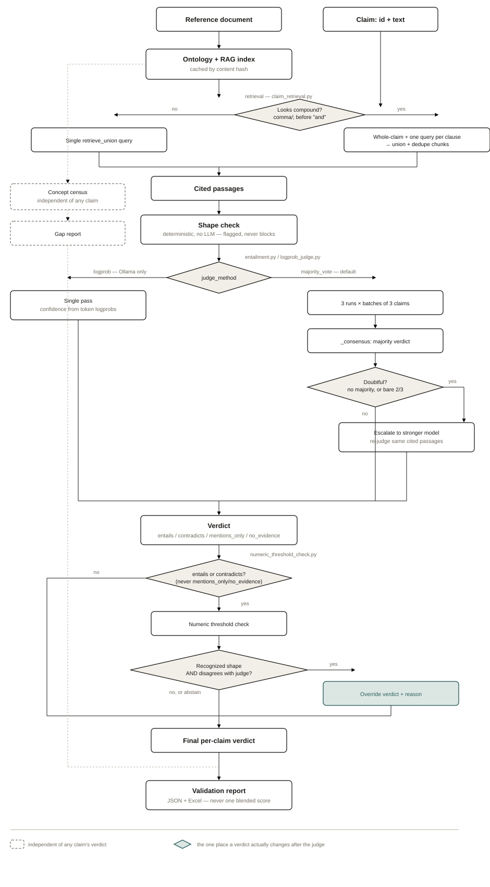
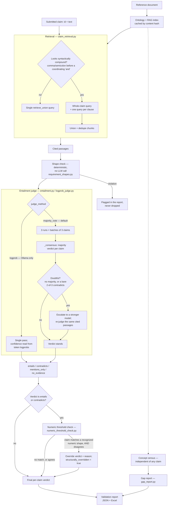

# Judge logic and data flow

A single, maintained diagram of what actually happens between a
submitted claim and its final verdict — kept current, not a snapshot.

**Update this when you change:** `claimvalidator/claim_retrieval.py`
(retrieval, compound-claim widening), `phases/requirement_shapes.py`
(shape check), `phases/entailment.py` (majority-vote judge,
consensus, escalation), `claimvalidator/logprob_judge.py` (logprob
judge), `claimvalidator/numeric_threshold_check.py` (structural
override), or the call order in `claimvalidator/pipeline.py::run_validation()`.
If a code change moves where a step happens relative to the others,
this diagram is wrong until it's edited to match.

The image above (`judge-flow.svg`, same directory) is the diagram —
open it directly if your viewer doesn't render an `` inside
markdown. It's a self-contained, hand-authored SVG (light/dark aware
via its own `prefers-color-scheme` media query), not a screenshot, so
editing it means editing the shapes and text in the file directly, the
same as any other source file. The Mermaid block below is kept as a
plain-text fallback and a quicker diff when only the logic changes,
not the layout — update both together.

## Notes that don't fit in boxes

- **The shape check never gates the judge.** A claim that fails it is
  judged anyway — the violation is reported alongside the verdict, not
  instead of one. "Flagged, not dropped" (paper, §07).
- **The logprob path bypasses escalation entirely.** Escalation lives
  inside `judge_entailment()`'s own majority-vote flow; the logprob
  judge (`judge_entailment_logprob`, Ollama only) is a separate
  function the pipeline calls instead of it, not through it.
- **The numeric override runs after the judge, never before.** It only
  ever looks at a verdict the judge already reached, and only touches
  `entails`/`contradicts` — `mentions_only`/`no_evidence` are left
  alone on purpose (a regex match on its own shouldn't unilaterally
  reclassify those).
- **The census/gap-report branch is fully independent.** It runs off
  the ontology alone, never touches a claim's own verdict, and the two
  outputs are never merged into one score — see the paper's own
  mechanism diagram (§02) for why that separation is deliberate.
