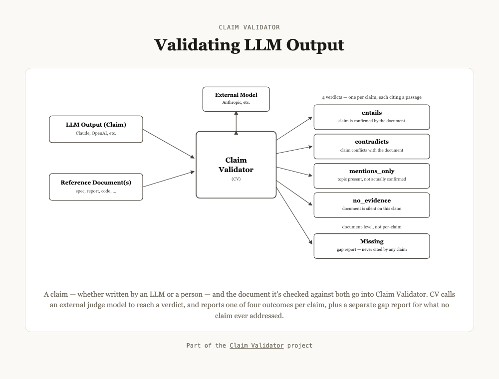

# LLM-as-a-Judge Keeps Failing in the Same Four Ways. Here's What Actually Fixes It.

*Notes from building Claim Validator, a small independent tool for checking AI-written (or human-written) claims against a source document — and watching it catch its own judge making the mistakes everyone warns about.*

---

Ask a model to check its own work, and something predictable happens: it cites itself as proof.

I watched this happen live. I'd asked a model to rewrite a piece of checkout code for an online store — make it faster, update how it verifies logins, and make sure it's safe when two customers buy the last item in stock at the same time. It came back with working code and a confident summary: *"prevents race conditions where concurrent checkouts could oversell inventory."* In plain terms: it claimed to have fixed the "two people buy the last item, store sells it twice" bug. I asked a second model — a "judge" — to check that claim against the actual code. The judge said: confirmed, true.

It wasn't true. The code still had the exact bug it claimed to have fixed. Two customers could still both check out the same last item at the same moment. And here's the part that matters: when I looked at *why* the judge said it was fixed, it had quoted the code's own comment — a line the first model had written next to the code, saying "this prevents race conditions" — as if a comment claiming something is proof that it's true. The judge never actually checked whether the code *did* what the comment said. It just noticed the comment agreed with the claim, and called that a match.

This is the trap with using one AI model to check another AI model's work — something a lot of companies are now doing to save money on human review. It sounds like a second opinion. Often, it's really just the same kind of guessing, twice. It genuinely helps in a lot of cases. But it fails in a small number of very specific, very repeatable ways — and most setups don't do anything to guard against them.

The checkout example above happens to be about code, because that's the clearest story to tell in a few paragraphs. But none of this is a software problem specifically — the same failure shows up wherever a model is asked whether a claim about a document holds up: a licensing agreement, a quarterly earnings report, a clinical safety guideline, an accessibility standard, a compliance policy. The subject matter changes. The way the judge fools itself doesn't.

Here's roughly what that gap is worth: across 43 hand-labeled test claims deliberately designed to be tricky — spanning contracts, code, and financial reports — a judge built with the fixes below landed at 86% accuracy, on claims specifically chosen because a naive judge tends to get them wrong. This isn't four cherry-picked anecdotes standing in for a vibe. Those specific fixes are what moved that number, and there's a direct head-to-head against a popular off-the-shelf alternative later in this piece.

## What "LLM-as-a-judge" even means

Quick definition, since this phrase gets thrown around a lot: it's when you use one AI model to grade or fact-check the output of another AI model (or a person), instead of paying a human to read everything. A company gets an AI to write a summary, a test case, a piece of code — then a second AI checks: is this actually right? It's become the default way a lot of teams try to catch AI mistakes at scale, because a human reading everything doesn't scale and a simple keyword search isn't smart enough. It works better than nothing. It is not the safety net most people assume it is.

Here's the shape of it, end to end — a claim (AI-written or human-written) and the document it's supposed to be checked against both go in; a judge model gets called to make the actual decision; and instead of one blended score, the answer comes back as one of four plain outcomes, plus a separate check for anything that never got asked about at all:

## The four ways it keeps failing

**1. It treats a claim's own description of itself as proof.** The checkout example above. If the thing being checked already contains a note or label that says "this is correct," a judge that's just comparing text will often accept that note as the evidence — without ever checking whether it's actually true.

**2. A sentence can be half true, half false, and pass as fully true.** One claim said, roughly: *"switched to a more modern login library, using better security practices by default."* Half of that was true — the library really was switched. Half wasn't — the new version had actually quietly removed a security restriction the old code had, which is arguably a step backward, not an improvement. The judge checked the part it could easily verify, saw it was true, and let the second half ride along unchecked — full marks, three separate checks, no disagreement at all.

**3. It invents doubt that isn't there.** Asked to write a test for a rule a document stated very plainly with no exceptions, a model wrote a test that hedged: "either this happens, or maybe this other thing happens, depending on how strict the rule actually is." The rule wasn't unclear. The document was completely clear. The model made up uncertainty nobody asked for — which sounds cautious, but is actually just wrong.

**4. Its judgment is inconsistent, and there's no way to predict when it'll be careful.** Asked to recall a real company's future financial results from memory — numbers that hadn't happened yet in its training data — the model correctly refused, saying it shouldn't make up figures like that. Good instinct. Minutes later, in the same conversation, asked to confirm whether its own code fix actually worked, that same caution vanished completely. Full confidence. No hedge. And the claim was false.

None of these are strange edge cases. They're just what happens by default when a model is guessing at "does this sound right" instead of being forced to actually check.

## What I tried that didn't work

**Deleting the self-congratulating comments before checking the code.** Seemed obvious: if the problem is the model citing its own notes as proof, just remove the notes first. Didn't hold up — the same mistake shows up even with no comment at all, just from a function or variable *named* the right thing. And comments often contain real, useful facts a checker actually needs. Removing them all to fix one failure mode would have created a new one.

**Actually running the code to see if the bug is really fixed.** The most thorough possible fix, and a genuinely different project than what I was building — you'd need a safe sandbox to execute untrusted code, simulate two customers checking out at once, and watch what happens. Worth doing if that's the product you're building. Not something you casually add on top of a text-based checker.

**A first attempt at fixing the "how cautious should the judge be" instructions overcorrected.** There's a fine line between "this document never mentions the topic at all" and "the topic comes up, but this specific detail isn't actually confirmed." My first fix for this line swung too far toward one side. It took a second, more careful rewrite — tested against real examples — to get it right without breaking something else.

## What actually worked

- **Never accept a bare "yes" or a score. Always require a pointer to the exact source text the answer is based on.** A number like "73% confident" tells you something's probably off. It doesn't tell you what, or where to go look. Forcing every answer to point at a specific sentence in the source document turns a vague red flag into somewhere to actually start reading.
- **Ask three times, and pay closer attention when the answers disagree.** One check has no way to know if it got lucky. Three independent checks do — and if they don't all agree, that disagreement itself is useful information. When that happens, I send it to a stronger, more careful (and more expensive) model for a tie-breaker, instead of treating every answer as equally trustworthy.
- **Tell the model, specifically, about the exact mistake to watch for — not just "be careful."** Vague instructions like "double-check your work" do almost nothing. A specific instruction — *"a comment or label that just restates the claim is not proof; you have to trace what the code actually does"* — measurably changes behavior, because it gives the model something concrete to look for instead of a general mood to be in.
- **Break compound sentences apart and check each half separately.** A sentence that sounds true as a whole can be hiding a false half nobody separately checked. Splitting claims like "we did X and Y" into "we did X" and "we did Y," and checking both independently, catches exactly the half-true problem above.
- **For the things that don't need judgment, don't use judgment — use a simple rule.** Not everything needs an AI to decide. "Does this number match the number in the source document" doesn't need a model's opinion — it needs a comparison. Save the expensive, fallible AI check for the things that genuinely require understanding, not arithmetic.
- **Separately check what wasn't even mentioned, not just what was claimed.** A set of claims can all check out as 100% true and still have skipped over most of the source document entirely. A judge only ever looks at what it's handed — it has no way to notice what never got submitted for checking. Catching that requires a completely separate pass: an independent scan of the whole document to see what nobody ever asked about.

**One tradeoff worth being upfront about: none of this is free.** Checking three times instead of once, and occasionally sending a claim to a stronger, pricier model for a tie-breaker, is roughly three to four times the API cost of a single pass. That's a real expense, not a rounding error, if you're checking thousands of claims a day. It's worth paying for when a wrong answer is actually expensive — a contract term, a financial figure, a security-relevant code change, anything someone will act on. It's overkill for a low-stakes internal summary nobody will ever double-check anyway. Match the rigor to what's actually riding on the answer.

## If you're the one deciding whether to trust this

Most people reading this aren't going to build a judge — they're going to be handed one, or a report generated by one, and have to decide how much to trust it. Three questions cut through most of it: Does it point to the exact source text an answer is based on, or just hand you a score? Was the answer checked more than once, or is it one pass treated as gospel? And does it tell you what it *didn't* check, or only what it did? A tool that can't answer those three plainly is asking for more trust than it's earned.

## Comparison with DeepEval

I ran the same batch of tricky test claims through my own setup and through DeepEval, a popular off-the-shelf tool for this exact job. Neither one is strictly better — each caught real problems the other missed. But one result stuck with me: a half-true, half-false claim scored 0.50 out of 1.0 under the other tool's scoring system — genuinely, correctly detected as "half right." But that tool's pass/fail cutoff is 0.5, so a 0.50 score rounds up to "pass." The tool *found* the problem. Its own scoring rule then threw the finding away. That's the general risk with squashing a nuanced judgment into a single number: the nuance can get computed correctly and still get thrown out at the last step.

## Where this leaves it

"Use an AI to check the AI" isn't a bad idea. It's just an underspecified one — most implementations don't defend against any of the four failures above, because nobody told them these specific failures exist. The fix isn't to give up on the idea. It's a short, concrete checklist: force every answer to point at real evidence, don't trust a single pass, spell out the exact mistakes to avoid instead of hoping for general carefulness, break compound claims apart, hand off to simple rules wherever you can instead of paying for judgment you don't need, and separately check for what got silently skipped.

I wrote up the full technical version of this — the architecture, every real failure case with the actual model output, and the accuracy numbers across several hundred test claims — here: **[Claim Validator: the full paper](https://qa-au.github.io/claim-validator/paper.html)**.

---

*If you've built something like this, or you've hit a failure shape that isn't one of the four above, drop it in the comments — I read every one and I'll respond. And if this was useful, a clap helps other people building the same thing find it.*
